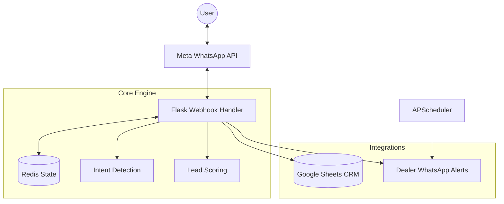

# ReplyFast Auto — WhatsApp Lead Qualification Bot 🚗💨

### Stop Missing Hot Leads. Qualify 24/7 on WhatsApp.

ReplyFast Auto is an autonomous WhatsApp bot designed specifically for car dealerships. It converts passive browsers into high-intent leads using AI-driven qualification funnels and instant dealer escalation.

---

## 🛑 The Problem
**Car dealerships lose 60% of leads** because they fail to respond within the first 5 minutes. Salespeople can't be available 24/7, and manual lead qualification is slow, inconsistent, and expensive.

## ✅ The Solution
An autonomous AI assistant that lives on WhatsApp. It engages every lead instantly, qualifies them based on budget, timeline, and intent, and alerts your sales team only when a **HOT** lead is ready to buy.

---

## ⚙️ How It Works: The 5-Step Funnel
The bot uses a conversion-optimized flow designed to maximize micro-commitments:

1.  **Instant Engagement**: Immediate greeting with value-prop buttons (e.g., "Find my dream car 🚀").
2.  **Strategic Budgeting**: Early budget discovery to segment the lead and show relevant inventory.
3.  **Low-Friction Lead Capture**: Captures Name and WhatsApp number before the user drops off.
4.  **Deep Qualification**: Profiling vehicle type (SUV, Sedan, etc.), condition (New/Used), and buying timeline.
5.  **Score & Escalate**: Categorizes leads as **HOT/WARM/COLD** and triggers instant alerts.

---

## 🛠️ Tech Stack
-   **Backend**: Flask (Python)
-   **Messaging**: Meta WhatsApp Business Cloud API
-   **State Management**: Redis (Session persistence with in-memory fallback)
-   **CRM Integration**: Google Sheets API (Direct & Async logging)
-   **Escalation Engine**: APSchedular for time-based alerts

---

## ✨ Key Features
-   **🔥 HOT Lead Escalation**: If a hot lead isn't contacted by a rep within 5 minutes, the bot sends an automated escalation alert to the manager.
-   **📊 Automated CRM Logging**: Every conversation is logged to a Google Sheet in real-time for easy tracking and follow-ups.
-   **🛡️ Duplicate Detection & Rate Limiting**: Built-in protection against spam and duplicate webhook triggers.
-   **🎯 Intent-Based Scoring**: Psychological triggers detect "Browsers" vs "Buyers" based on response sentiment and keywords.
-   **📱 Multi-Tenant Support**: Configurable for multiple dealerships via `clients.json`.

---

## 🏗️ Architecture


---

## 🚀 Quick Start

### 1. Prerequisites
- Python 3.9+
- Redis Server
- Meta Developer Account (WhatsApp Cloud API)
- Google Cloud Service Account (for Sheets)

### 2. Environment Setup
Create a `.env` file with the following:
```env
META_API_TOKEN=your_token
META_PHONE_ID=your_id
WEBHOOK_VERIFY_TOKEN=your_token
REDIS_HOST=localhost
REDIS_PORT=6379
SHEET_ID=your_google_sheet_id
GOOGLE_CREDENTIALS_FILE=secrets.json
```

### 3. Installation
```bash
pip install -r requirements.txt
python app.py
```

---

## 🧠 Developed by
Built to help dealerships scale their sales operations without increasing headcount.
